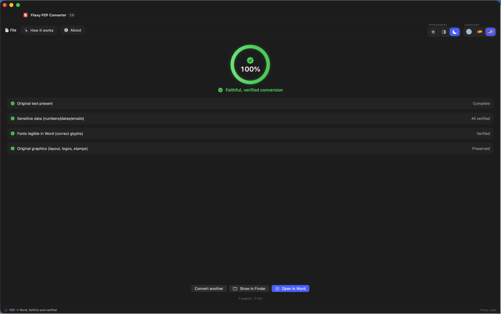
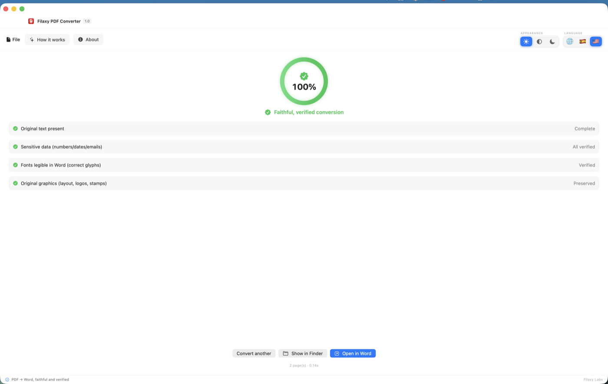
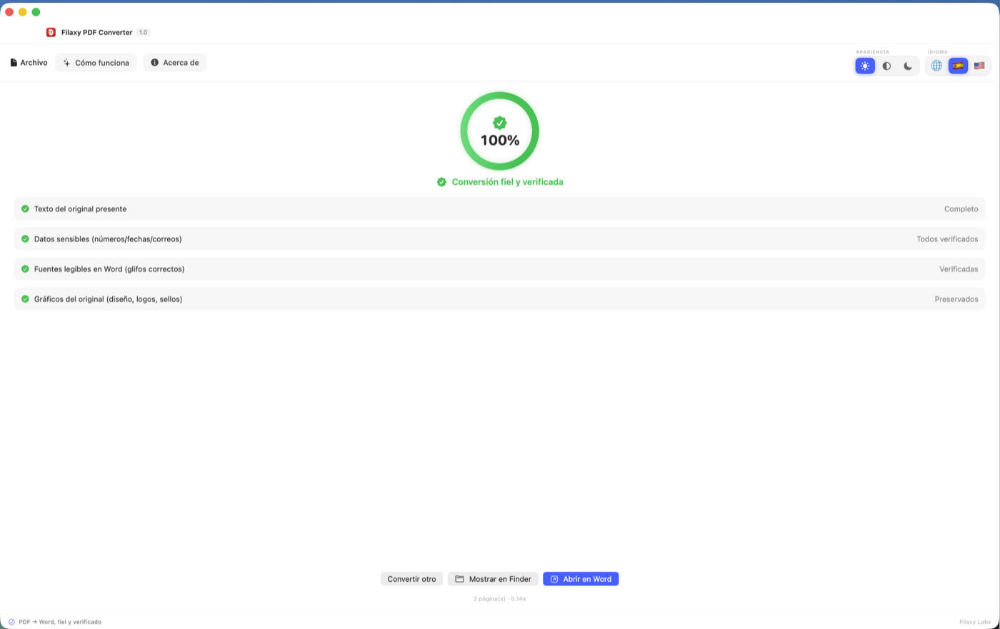
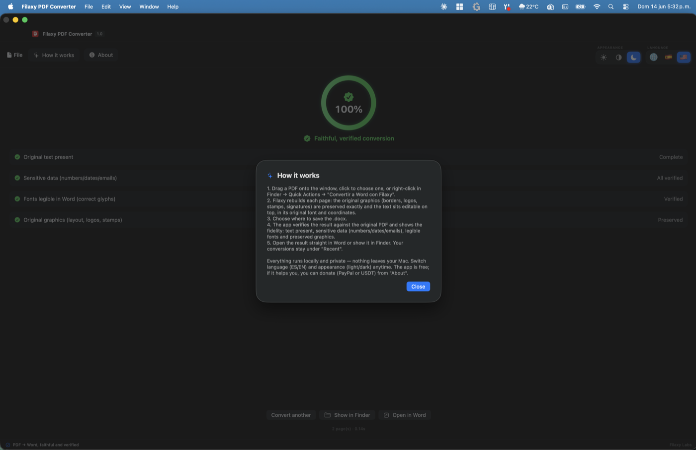

<div align="center">

# Filaxy PDF Converter

**Convert PDF → Word (.docx) preserving images, box positions, fonts, signatures
and every section exactly as the original — then *verify* it.**

A free, open-source, fully-offline macOS app by [Filaxy Labs](https://filaxylabs.co).

[](https://github.com/othmarodev/filaxy-pdf-converter/actions/workflows/ci.yml)
[](LICENSE)


### [⬇ Download Filaxy PDF Converter](https://github.com/othmarodev/filaxy-pdf-converter/releases/latest)

Signed &amp; notarized `.dmg` — opens with no Gatekeeper warnings.

</div>

---

## Download

**[Download the latest release →](https://github.com/othmarodev/filaxy-pdf-converter/releases/latest)** — Apple-notarized `.dmg`.

1. Open the `.dmg` and drag **Filaxy PDF Converter** into **Applications**.
2. Launch it — no security warnings (signed with a Developer ID + notarized by Apple).

**Requirements:** macOS 13 (Ventura)+ · Apple Silicon (arm64).

## Why it exists

Most PDF→Word tools reflow your document into a soup of text. The ones that keep
the layout still leave you guessing whether a number, a date or a signature
silently drifted. This app does two things that matter:

1. **High-fidelity conversion** — every text line, image and vector graphic is
   placed at its exact source coordinates, so position and layout are preserved
   *by construction*.
2. **Fidelity verification** — after converting, it re-reads the *original* PDF's
   text layer (the ground truth) and compares it against the produced Word file,
   flagging any drift in **numbers, dates and emails**, and checking that fonts
   render correctly and the original graphics survived.

That verification step is the reason the project exists: a salary certificate, an
invoice or a contract is worthless if a single figure converts wrong.

## Screenshots

<p align="center">
  
</p>

After every conversion you get a **fidelity report** — text recall, sensitive-data
drift, font renderability and preserved graphics — so the file is one you can trust.

<p align="center">
  
  
</p>

Light & dark themes and **live ES / EN** localization — switch anytime.

<p align="center">
  
</p>

## How it works

```
┌─────────────────────┐     JSON      ┌──────────────────────────────────┐
│  macOS app (Swift)  │ ───────────▶  │  engine (self-contained binary)  │
│  SwiftUI · MVVM     │ ◀───────────  │  coordinate-map → verify         │
│  zero Swift deps    │   fidelity    │  no Python/venv at runtime       │
└─────────────────────┘    report     └──────────────────────────────────┘
```

The conversion engine is **original** — a coordinate-mapping reconstruction:

- The original page's **graphics** (borders, fills, logos, stamps, signatures)
  are rasterised to a pixel-faithful, full-page **background** with the text
  stripped out — so nothing has to be redrawn vector-by-vector.
- The **text** is laid back on top as editable paragraphs, each anchored at its
  exact source coordinates, in the original **embedded fonts** (carried into the
  `.docx` per ECMA-376 §17.8.1, with a Unicode-cmap safety net so glyphs like the
  colón `₡` always render).

The result looks identical to the source *and* stays editable.

### Repository layout

- **`Sources/FilaxyPDFConverter/`** — the native macOS app. Pure Swift, no
  third-party packages. Custom in-window chrome, live ES/EN localization,
  light/dark themes, drag-&-drop, fidelity report, recents, "Open in Word".
- **`engine/`** — the offline engine:
  - `coordmap.py` — the coordinate-mapping conversion engine (the core).
  - `verify.py` / `verify_render.py` — the fidelity-verification layer (text
    recall, sensitive-data drift, font renderability). Handles the narrow
    no-break spaces in Costa-Rican money formatting, e.g. `2 282 144,79`.
  - `cli.py` — the JSON contract consumed by the Swift app.
- **`tools/freeze_engine.sh`** — packages the engine into a self-contained
  binary (PyInstaller) so the shipped `.app` needs no Python or venv.

> **Honest credits:** PDF parsing & rasterisation use
> [PyMuPDF](https://pymupdf.readthedocs.io) (AGPL / commercial); font embedding
> uses [fontTools](https://github.com/fonttools/fonttools) (MIT). The
> coordinate-mapping engine, the verification layer, the native app and the
> packaging are original. *(An earlier prototype leaned on `pdf2docx`; it was
> replaced by the coordinate-mapping engine.)*

## Build from source

Requirements: macOS 13+, a Swift toolchain, Python 3.9+.

```bash
# 1. Engine deps
python3 -m venv .venv && source .venv/bin/activate
pip install -r engine/requirements.txt

# 2. Quick engine test (convert + verify a PDF)
python -m engine.cli input.pdf output.docx

# 3. (optional) Freeze the engine into a self-contained binary
tools/freeze_engine.sh

# 4. Assemble the macOS app
./build-app.sh            # filaxy.shop build (donations + Finder Quick Action)
./build-app.sh appstore   # App Store build (sandbox-friendly, no donations)
```

## Roadmap

- [x] Coordinate-mapping conversion engine (max fidelity by construction)
- [x] Fidelity verification (text + sensitive data + font renderability + graphics)
- [x] Native SwiftUI app (premium chrome, ES/EN, light/dark, recents, Open in Word)
- [x] Self-contained frozen engine (PyInstaller) — no Python at runtime
- [x] Two build variants (App Store / filaxy.shop)
- [ ] Free OCR fallback (Tesseract) for scanned PDFs
- [x] Developer ID signed + notarized DMG ([download](https://github.com/othmarodev/filaxy-pdf-converter/releases/latest))
- [ ] Homebrew cask · landing on [filaxy.shop](https://filaxy.shop)
- [ ] Universal build (Intel + Apple Silicon)
- [ ] App Store release (sandboxed)

## Support the project

Filaxy PDF Converter is free. If it saved you time, the app's **About** panel
(filaxy.shop build) has voluntary, optional donation options — PayPal and
USDT (TRC20). Completely up to you. 💛

## License

[MIT](LICENSE) © 2026 Othmaro Fallas Rojas — Filaxy Labs, Inc.
